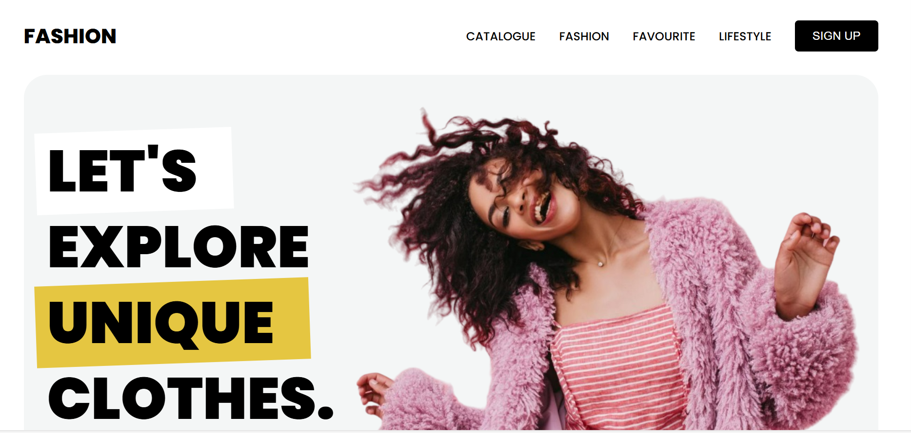

# Fashion Website



A modern and responsive fashion website template that allows users to explore new arrivals, sales, favorite items, and lifestyle promotions. Built with HTML and CSS, this project showcases collections, promotional banners, and newsletter sign-ups.

## Features

- Fully responsive design for all screen sizes
- Navigation menu with smooth scrolling
- New arrivals section with product cards
- Sale and promotional banners
- Young's favorite section showcasing popular items
- Download app & voucher promotion
- Email subscription form for promos
- Footer with company info, links, and social media

## Demo

[Live Demo](#)

## Technologies Used

- HTML5
- CSS3
- JavaScript (ES6)
- ScrollReveal.js for animations
- Remix Icon for icons

## Sections Overview

**New Arrivals:** Browse the latest collection of hoodies, coats, and tees.  

**Payday Sale:** Special promotional offers with discounts for limited periods.  

**Young's Favourite:** Highlights trending items and affordable collections.  

**Lifestyle & App Promotion:** Download app promotions with vouchers for first purchases.  

**Newsletter & Community:** Subscribe to get monthly promotions and updates.  

## Installation

1. Clone the repository:

```powershell
git clone https://github.com/fsafiya187/Fashion-Website.git

2.Navigate to the project directory:

cd Fashion-Website


3.Open index.html in your browser.

---

Usage

Explore the catalogue for new arrivals.

Check ongoing sales and promotions.

Browse popular items in the favorites section.

Download the app for exclusive vouchers.

Subscribe to the newsletter to stay updated.

---

License

This project is licensed under the MIT License.

---

Contact

Email: fsafiya187@gmail.com

GitHub: fsafiya187